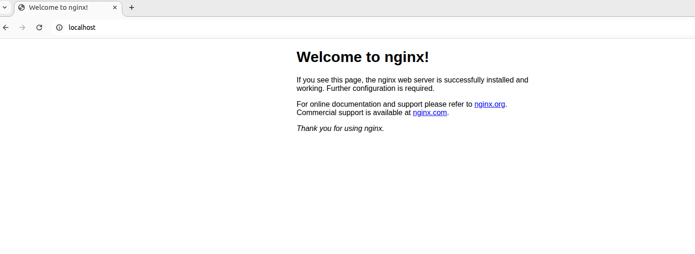

# 1.环境

想要分析 Linux 环境下的 nginx 的简单功能具体是如何实现的首先需要一个 Linux 环境。

此次使用 VirtualBox 来创建一个 Linux 环境

- [VirtualBox](https://blog.csdn.net/weixin_41812346/article/details/150585718?spm=1011.2415.3001.5331)

---

系统信息

执行以下命令：
```shell
uname -a
```

输出：
```
Linux wsd-ubuntu 6.8.0-90-generic #91~22.04.1-Ubuntu SMP PREEMPT_DYNAMIC Thu Nov 20 15:20:45 UTC 2 x86_64 x86_64 x86_64 GNU/Linux
```

**uname -a 命令输出的各个字段含义如下：**

1. Kernel name（内核名称）: 第一个字段，通常是 “Linux”，表示操作系统内核的名称。

2. Hostname（主机名）: 第二个字段，显示当前系统的主机名。（此处是 wsd-ubuntu）

3. Kernel release（内核发布版本）: 第三个字段，显示内核的发布版本号。（此处是 6.8.0-90-generic）

4. Kernel version（内核版本）: 第四个字段，显示内核的编译版本信息，包括编译时间、编译者等详细信息。

5. Machine hardware name（机器硬件名称）: 第五个字段，显示硬件架构，如 “x86_64” 表示64位Intel/AMD处理器。

6. Processor type（处理器类型）: 第六个字段，通常与机器硬件名称相同，显示处理器架构。

7. Hardware platform（硬件平台）: 第七个字段，显示硬件平台信息。

8. Operating system（操作系统）: 最后一个字段，显示操作系统名称，通常是 “GNU/Linux”。

> uname -a 命令实际上等同于同时使用多个选项：
-s（内核名称）、-n（主机名）、-r（内核发布版本）、-v（内核版本）、
-m（机器硬件名称）、-p（处理器类型）、-i（硬件平台）和 -o（操作系统）。
这个命令是查看Linux系统内核和硬件基本信息最常用的工具之一。

---

# 2.nginx-1.24.0 源码 编译安装

[nginx-1.24.0 源码 编译安装](https://blog.csdn.net/weixin_41812346/article/details/145267995?spm=1011.2415.3001.5331)

---

# 3.运行，分析

 ## 1.编译配置
 ```c
sudo ./configure \
--sbin-path=/home/wsd/Desktop/Nginx \
--conf-path=/home/wsd/Desktop/Nginx/conf/nginx.conf \
--error-log-path=/home/wsd/Desktop/Nginx/log/error.log \
--http-log-path=/home/wsd/Desktop/Nginx/log/access.log
```

---


```c
sudo make 
```
重新编译

---

```c
sudo make install
```
安装 编译后的可执行文件

---

配置文件 nginx.conf 如下
```c
worker_processes  1;

events {
    worker_connections  1024;
}


http {
    server {
        listen       80 deferred;
        server_name  localhost;

        location / {
            root   html;
            index  index.html index.htm;
        }

        error_page   500 502 503 504  /50x.html;
        location = /50x.html {
            root   html;
        }
    }
}
```

---

## 2.运行
```c
sudo ./nginx
```
启动 nginx

---

打开浏览器访问

http://localhost:80


---

## 3.分析代码

上面所示 启动 nginx 后 到 浏览器访问成功显示页面，到底是如何实现的？

为了搞清楚以上问题 接下来就需要分析源代码

分析源代码首先就要找到 mian 函数，main 函数是源代码中最先被执行的

main 函数
定义在
`./nginx-1.24.0/src/core/nginx.c`